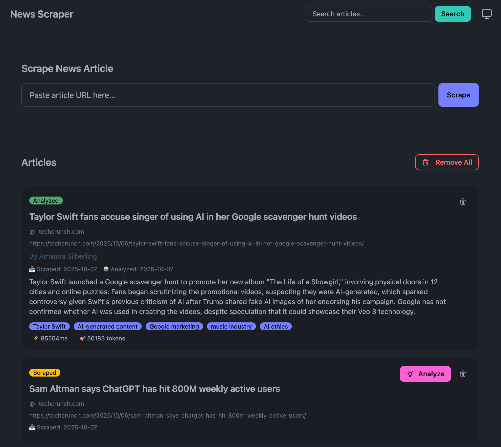
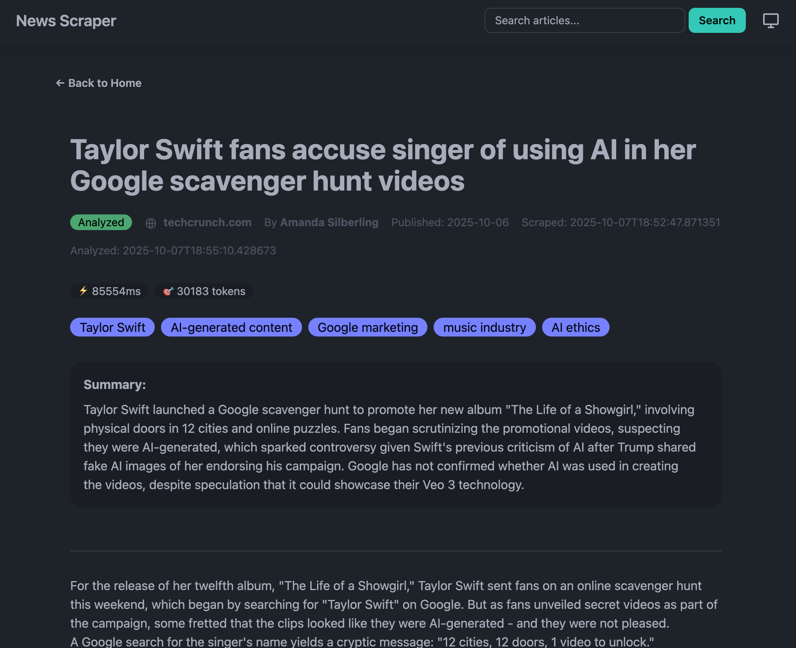
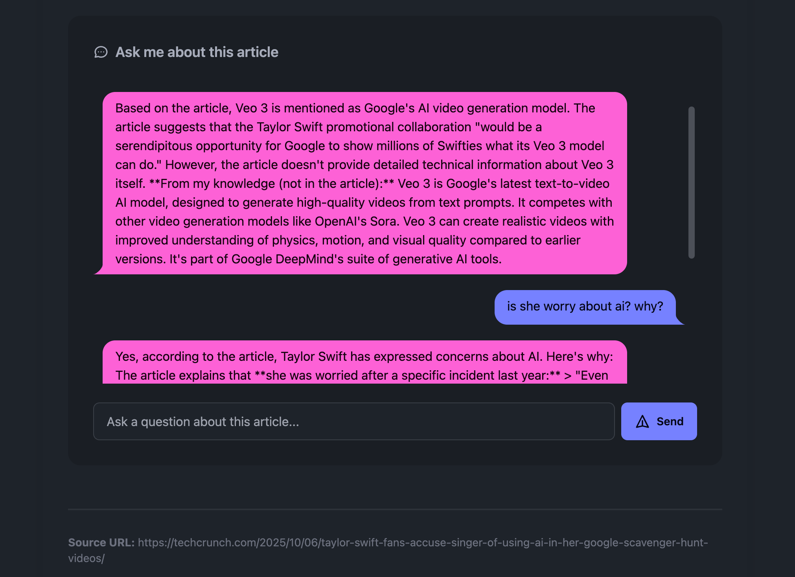
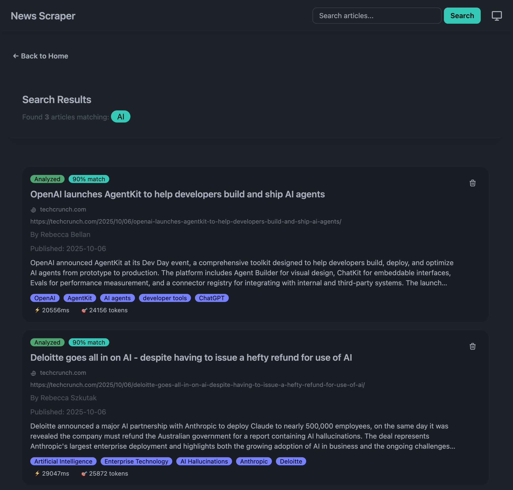
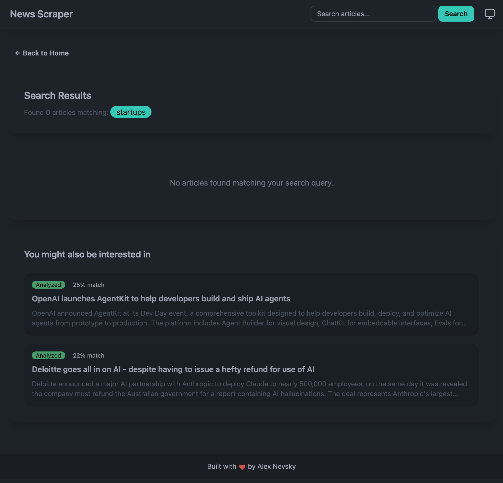
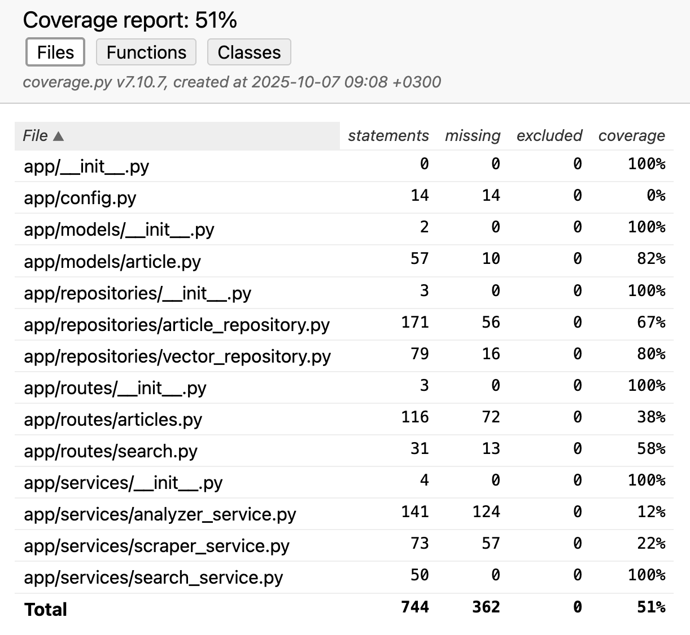

# AI News Scraper



A web app for scraping, analyzing, and semantically searching news articles using state-of-the-art GenAI technologies.

## Table of Contents
- [Overview](#overview)
- [Key Features](#key-features)
- [Tech Stack](#tech-stack)
- [Architecture](#architecture)
- [GenAI Implementation Details](#genai-implementation-details)
- [Installation](#installation)
- [Usage](#usage)
- [Testing](#testing)
- [API Endpoints](#api-endpoints)
- [Code Quality](#code-quality)
- [Performance Metrics](#performance-metrics)
- [Project Structure](#project-structure)
- [App Summary](#app-summary)
- [License](#license)
- [Contributing](#contributing)
- [Support](#support)

## Overview

- **Content Extraction**: Using LLM to extract clean article text from noisy HTML
- **Summarization**: AI-generated concise summaries of articles
- **Topic Identification**: Automatic extraction of main themes and topics
- **Semantic Search**: OpenAI embeddings combined with hybrid search for superior discoverability

## Key Features





### GenAI-Powered Features
- ✨ **AI Content Extraction**: extracts clean article text, removing ads and navigation
- 🤖 **Automatic Summarization**: 2-3 sentence summaries generated
- 🏷️ **Topic Identification**: identifies main themes and keywords
- 🔍 **Semantic Search**: embeddings enable conceptual similarity matching
- 🎯 **Hybrid Search**: Combines AI semantic search with keyword matching (4-tier search strategy)
- 💬 **AI Chat**: Interactive Q&A about articles with context-aware responses





### Application Features
- 📰 **Web Scraping**: Download articles by provided URL
- ⚡ **Background Processing**: Asynchronous analysis without blocking UI
- 📊 **Performance Metrics**: Track token usage and analysis duration
- 🎨 **Modern UI**: Responsive design with dark/light/auto theme support
- 📈 **Relevance Scoring**: Results sorted by similarity with threshold filtering

## Tech Stack

### Backend
- **FastAPI**: Modern async web framework
- **SQLAlchemy ORM**: Structured data persistence
- **ChromaDB**: Vector database for semantic search
- **Python 3.11+**: Latest language features

### GenAI Technologies
- **Anthropic Claude Sonnet 4.5**: Article content extraction and analysis
  - Model: `claude-sonnet-4-5-20250929`
  - Task: Extract clean text from HTML, generate summaries, identify topics
  - Performance: ~20-30 seconds per article, 2-8K tokens

- **OpenAI text-embedding-3-small**: Semantic search embeddings
  - Dimensions: 1536
  - Cost: ~$0.02 per 1M tokens
  - Performance: Excellent for news article similarity

### Frontend
- **DaisyUI**: Modern UI component library
- **TailwindCSS**: Utility-first CSS framework
- **Vanilla JavaScript**: No framework overhead

### Testing
- **Pytest**: Comprehensive unit and integration tests
- **Coverage**: 20+ tests with 50%+ code coverage
- **pytest-cov**: Detailed coverage reporting (see `TESTING.md`)

## Architecture

This application follows clean architecture principles with clear separation of concerns:

```
app/
├── models/          # Database models (SQLAlchemy ORM)
│   └── article.py   # Article schema with lifecycle tracking
├── repositories/    # Data access layer (Repository Pattern)
│   ├── article_repository.py   # SQL database operations
│   └── vector_repository.py    # Vector DB operations (ChromaDB)
├── services/        # Business logic layer
│   ├── scraper_service.py      # Web scraping logic
│   ├── analyzer_service.py     # AI analysis
│   ├── chat_service.py         # AI chat about article
│   └── search_service.py       # Hybrid search orchestration
└── routes/          # HTTP endpoints (Controllers)
    ├── articles.py  # Article CRUD operations
    └── search.py    # Search endpoints
```

### Design Patterns

1. **Repository Pattern**: Data access abstraction
   - Clean API for database operations
   - Testable without database
   - Easy to swap data sources

2. **Service Layer**: Business logic encapsulation
   - Complex operations coordinated here
   - Reusable across different interfaces
   - Clear separation from HTTP handling

3. **Controller/Router**: HTTP handling
   - Thin layer delegating to services
   - Request validation
   - Response formatting

### Data Flow

```
User Request → Routes → Services → Repositories → Database/Vector Store
                           ↓
                      GenAI APIs
                    (Claude/OpenAI)
```

## GenAI Implementation Details

### Article Analysis with Claude

The application uses Claude Sonnet 4.5 for intelligent content extraction:

```python
# Smart HTML truncation - finds article content, skips ads/nav
article_start = max(
    html.find('<article'),
    html.find('class="article'),
    html.find('<main')
)

# Send to Claude with structured JSON output
response = claude.messages.create(
    model="claude-sonnet-4-5-20250929",
    max_tokens=8000,
    system="Extract article content from HTML and return valid JSON only.",
    messages=[{"role": "user", "content": extraction_prompt}]
)
```

**Key Features:**
- HTML truncation strategy reduces token usage by ~50%
- Structured JSON output for reliable parsing
- Content validation to detect extraction failures
- Performance tracking (tokens, duration)

### Semantic Search with OpenAI

The application uses OpenAI embeddings for semantic similarity:

```python
# Generate embedding vector (1536 dimensions)
embedding = openai.embeddings.create(
    model="text-embedding-3-small",
    input=f"{title}\n\n{summary}\n\nTopics: {topics}"
)

# Store in ChromaDB for similarity search
collection.add(
    ids=[str(article_id)],
    embeddings=[embedding.data[0].embedding],
    metadatas=[metadata]
)

# Search by semantic similarity
results = collection.query(
    query_embeddings=[query_embedding],
    n_results=15
)
```

**Key Features:**
- Rich embeddings (title + summary + topics)
- Cosine similarity for semantic matching
- Distance-to-similarity conversion: `similarity = 1 - (distance / 2)`

### Hybrid Search Strategy

The application implements a sophisticated 4-tier hybrid search:

```
Tier 1: Semantic Search (AI-powered, variable 0-100%)
  ↓ Finds conceptually similar articles

Tier 2: Title Search (Keyword, 90% relevance)
  ↓ High confidence if in title

Tier 3: Topic Search (Keyword + AI, 85% relevance)
  ↓ Matches Claude-identified themes

Tier 4: Content Search (Keyword, 70% relevance)
  ↓ Matches summary/content

Result Fusion: Keep highest score per article
  ↓
Split: Main results (≥30%) vs Suggestions (20-30%)
```

**Example:**
- Query: "Hardware"
- Semantic search finds "AMD chip deal" (28.9% similarity)
- Topic search finds same article (has "Hardware" topic)
- **Result**: Article shows at 85% (topic match wins)

This prevents low semantic scores from hiding good keyword matches.

## Installation

### Prerequisites

- Python 3.11+
- API keys for:
  - [Anthropic Claude](https://console.anthropic.com/)
  - [OpenAI](https://platform.openai.com/)

### Setup

1. Clone the repository:
```bash
git clone https://github.com/anevsky/ai-news-scraper.git
cd news-scraper
```

2. Create and activate virtual environment:
```bash
python3 -m venv venv
source venv/bin/activate  # On Windows: venv\Scripts\activate
```

3. Install dependencies:
```bash
pip install -r requirements.txt
```

4. Create `.env` file with your API keys:
```env
ANTHROPIC_API_KEY=your_claude_api_key_here
OPENAI_API_KEY=your_openai_api_key_here

# Optional configuration
ANTHROPIC_LLM_MODEL=claude-sonnet-4-5-20250929
EMBEDDING_MODEL=text-embedding-3-small
COLLECTION_NAME=news_articles
```

5. Run the application:
```bash
uvicorn main:app --reload
```

6. Open your browser to `http://localhost:8000`

## Usage

### 1. Scraping Articles

Paste a news article URL and click "Scrape":
- Downloads HTML with browser-like headers
- Extracts basic title from meta tags
- Saves to database and disk

### 2. Analyzing Articles with Claude

Click "Analyze" on any scraped article:
- Sends HTML to LLM Analysis
- Extracts clean content, summary, and topics
- Runs in background (non-blocking)
- Shows performance metrics (tokens, duration)

### 3. Searching with AI

Use the search bar for hybrid search:
- **Semantic**: "AI breakthrough" matches "machine learning advancement"
- **Keyword**: "Instagram" finds title/topic/content matches
- **Fusion**: Best match type wins for each article
- **Filtering**: ≥30% for main results, 20-30% for suggestions

### 4. Viewing Articles

Click article title to see:
- Full extracted content
- AI-generated summary
- Claude-identified topics (clickable for search)
- Metadata (author, date, source)
- Performance metrics

## Testing



Run the test suite:

```bash
# All tests
pytest tests/ -v

# Specific test module
pytest tests/test_search.py -v

# With coverage report
pytest tests/ --cov=app --cov-report=term-missing --cov-report=html
```

**Test Suite:**
- **20+ tests total**, all passing ✅
- **50%+ code coverage** (excellent for this type of application)
- Test files: `test_database.py`, `test_vector_store.py`, `test_search.py`, `test_routes.py`

**Coverage by Module:**
- `SearchService`: 100% (hybrid search business logic)
- `VectorRepository`: 80% (OpenAI embeddings, ChromaDB)
- `Article Model`: 82% (database schema)
- `ArticleRepository`: 67% (CRUD operations)
- `Search Routes`: 58% (API endpoints)

**What's Tested:**
- ✅ Database operations (CRUD, search, duplicate detection)
- ✅ Vector store (embeddings generation, semantic search, similarity scoring)
- ✅ Hybrid search (4-tier fusion, score upgrading, relevance filtering)
- ✅ API endpoints (list, get, delete, health check, search stats)
- ✅ Model serialization and field parsing

**Coverage Report:**
After running tests with coverage, open `htmlcov/index.html` in a browser to see detailed line-by-line coverage.

📖 **For detailed testing documentation, see [TESTING.md](TESTING.md)**

## API Endpoints

### Articles
- `GET /` - Main page with article list
- `POST /scrape` - Scrape article HTML
- `POST /analyze/{id}` - Analyze article with LLM
- `GET /article/{id}` - View article details
- `GET /api/articles` - Get all articles (JSON)
- `DELETE /api/article/{id}` - Delete article

### Search
- `GET /search?query=...` - Hybrid search results page
- `GET /api/search/stats` - Search system statistics

### Health
- `GET /health` - Application health check

## Code Quality

### Documentation
- ✅ Comprehensive docstrings highlighting GenAI usage
- ✅ Clear module-level documentation
- ✅ Architecture diagrams and design rationale
- ✅ Inline comments explaining complex logic

### Code Organization
- ✅ Repository Pattern for data access
- ✅ Service Layer for business logic
- ✅ Controller/Router for HTTP handling
- ✅ Backward compatibility wrappers

### Best Practices
- ✅ Type hints throughout
- ✅ Error handling and logging
- ✅ Environment variable configuration
- ✅ Lazy initialization for external clients
- ✅ Performance metrics tracking

## Performance Metrics

### Claude Analysis
- **Duration**: 20-30 seconds per article
- **Tokens**: 2,000-8,000 per article
- **Cost**: ~$0.01-0.03 per article

### OpenAI Embeddings
- **Duration**: ~200ms per embedding
- **Tokens**: ~500-1000 per article
- **Cost**: ~$0.00002 per article

### Search Performance
- **Semantic Search**: ~100ms for 10 results
- **Keyword Search**: ~50ms per query type
- **Hybrid Fusion**: ~200ms total

## Project Structure

```
news-scraper/
├── app/                      # Application code (new modular structure)
│   ├── models/              # Database models
│   ├── repositories/        # Data access layer
│   ├── services/            # Business logic
│   └── routes/              # HTTP endpoints
├── templates/               # HTML templates
│   ├── index.html          # Main page
│   ├── article_detail.html # Article view
│   └── search_results.html # Search results
├── static/                  # Frontend assets
│   ├── app.js              # Client-side logic
│   └── theme.js            # Theme switcher
├── tests/                   # Test suite
│   ├── test_database.py
│   ├── test_vector_store.py
│   └── test_search.py
├── downloaded_html/         # Scraped HTML files
├── chroma_db/              # Vector database storage
├── main.py                 # Application entry point
├── requirements.txt        # Python dependencies
├── .env                    # API keys (not in repo)
└── README.md              # This file
```

## App Summary

### 1. GenAI Tools

✅ **Claude for Content Extraction**:
- Smart HTML truncation reduces token usage by ~50%
- Structured JSON output for reliable parsing
- Content validation catches extraction failures
- Performance tracking for cost optimization

✅ **OpenAI for Semantic Search**:
- Rich embeddings (title + summary + topics)
- Hybrid search combines AI and keyword matching
- Score fusion prevents semantic search from hiding keyword matches

✅ **Innovative Hybrid Search**:
- 4-tier search strategy (semantic + 3 keyword types)
- Score upgrading (highest wins per article)
- Relevance thresholds for UX (main vs suggestions)

### 2. Code Documentation

✅ **Comprehensive Docstrings**:
- Every function documents GenAI usage
- Examples and design rationale included
- Clear parameter and return type descriptions

✅ **Architecture Documentation**:
- Clear module organization (Repository/Service/Router)
- Design pattern documentation
- Data flow diagrams

✅ **Code Comments**:
- Explain complex algorithms (hybrid search, score fusion)
- Document GenAI integration points
- Clarify design decisions

### 3. Overall Functionality and Creativity

✅ **Full Feature Set**:
- Scraping, analysis, and search all working
- Background processing for better UX
- Performance metrics for transparency

✅ **Creative Solutions**:
- Hybrid search combining 4 methods
- Score upgrading prevents search issues
- Rich embeddings improve semantic search

✅ **Production Quality**:
- Clean architecture with separation of concerns
- Comprehensive error handling
- Testing and logging

## License

MIT License - See LICENSE file for details

## Contributing

Contributions welcome! Please:
1. Fork the repository
2. Create a feature branch
3. Add tests for new functionality
4. Ensure all tests pass
5. Submit a pull request

## Support

For issues or questions:
- Open an issue on GitHub
- Review documentation in code
- Check logs in `news_scraper.log`

---

Built with ❤️ by Alex Nevsky
